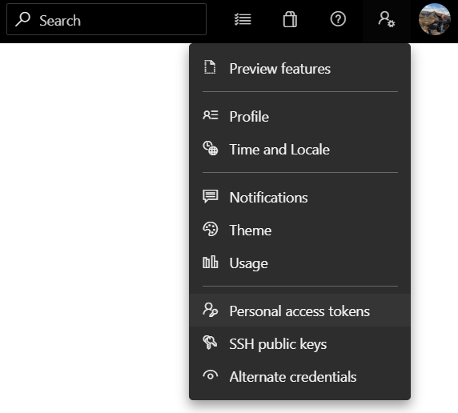

# devops-exporter

## Introduction

This script can be used to export Azure DevOps pipelines.

## 1. Usage

1. Create a Personal Access Token with read access on the `Build` and `Release` scopes:
  
2. Copy the `.env.example` file to `.env`, and replace the token and organization url placeholders.
3. Run the main script as:
    ```sh
    # download release pipelines
    python main.py 'Albert Heijn' --release
    # download build pipelines
    python main.py 'Albert Heijn' --build
    # download build pipelines 1 and 2
    python main.py 'Albert Heijn' --build --ids 1 2
    ```
